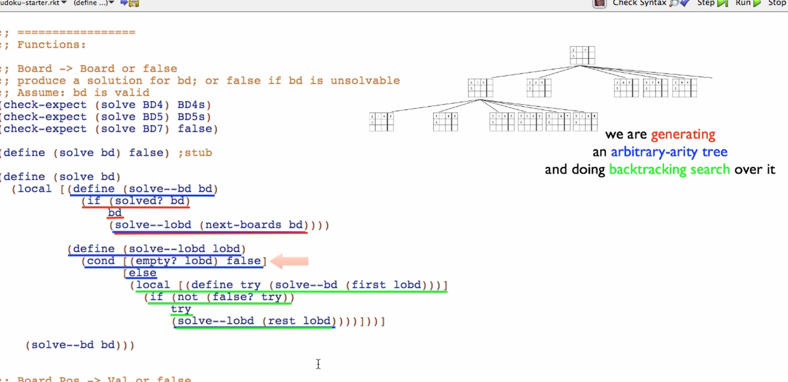

# Sudoku Solver
### By way of Brute Force Search

---

#### Domain analysis:

9x9 board
81 squares
9 rows
9 columns
9 boxes

27 total units = 9 + 9 + 9 units

Goal of the game is to fill every square with a natural number 1-9 while ensuring there are
no rows, columns, or boxes that contain a duplicate number.

---

### Brute Force Solver

#### Data Definitions

`Val` is a Natural[1, 9]
`Board` is (listof Val|false) that is 81 elements long (9x9)
`Pos` is Natural[0, 80]
    interp. the position of a square on the board, for a given p, then
        - the row is quotient p 9
        - the column is remainder p 9

Convert 0-based row and column to Pos:
```
(define (r-c->pos r c) (+ (* r 9) c))
```

`Unit` is (listof Pos) of length 9
    interp. the position of every square in a unit. There are 27 of these (9 rows, 9 cols, 9 boxes)

```
(define ALL-VALS (list 1 2 3 4 5 6 7 8 9))

// easier than writing FALSE FALSE FALSE -> B B B
(define B false)

(define BD1
    (list B B B B B B B B B
          B B B B B B B B B
          B B B B B B B B B
          B B B B B B B B B
          B B B B B B B B B
          B B B B B B B B B
          B B B B B B B B B
          B B B B B B B B B
          B B B B B B B B B))

(define BD2
    (list 1 2 3 4 5 6 7 8 9
          B B B B B B B B B
          B B B B B B B B B
          B B B B B B B B B
          B B B B B B B B B
          B B B B B B B B B
          B B B B B B B B B
          B B B B B B B B B
          B B B B B B B B B))

(define BD3
    (list 1 B B B B B B B B
          2 B B B B B B B B
          3 B B B B B B B B
          4 B B B B B B B B
          5 B B B B B B B B
          6 B B B B B B B B
          7 B B B B B B B B
          8 B B B B B B B B
          9 B B B B B B B B))

// easy board
(define BD4
    (list 2 7 4 B 9 1 B B 5
          1 B B 5 B B B 9 B
          6 B B B B 3 2 8 B
          B B 1 9 B B B B 8
          B B 5 1 B B 6 B B
          7 B B B 8 B B B 3
          4 B 2 B B B B B 9
          B B B B B B B 7 B
          8 B B 3 4 9 B B B))

// easy board solution
(define BD4s
    (list 2 7 4 8 9 1 3 6 5
          1 3 8 5 2 6 4 9 7
          6 5 9 4 7 3 2 8 1
          3 2 1 9 6 4 7 5 8
          9 8 5 1 3 7 6 4 2
          7 4 6 2 8 5 9 1 3
          4 6 2 7 5 8 1 3 9
          5 9 3 6 1 2 8 7 4
          8 1 7 3 4 9 5 2 6))

// hard board
(define BD5
    (list 5 B B B B 4 B 7 B
          B 1 B B 5 B 6 B B
          B B 4 9 B B B B B
          B 9 B B B B 7 5 B
          1 8 B 2 B B B B B
          B B B B B 6 B B B
          B B 3 B B B B B 8
          B 6 B B 8 B B B 9
          B B 8 B 7 B B 3 1))

// hard board solution
(define BD5s
    (list 5 3 9 1 6 4 8 7 2
          8 1 2 7 5 3 6 9 4
          6 7 4 9 2 8 3 1 5
          2 9 6 4 1 7 5 8 3
          1 8 7 2 3 5 9 4 6
          3 4 5 8 9 6 1 2 7
          9 2 3 5 4 1 7 6 8
          7 6 1 3 8 2 4 5 9
          4 5 8 6 7 9 2 3 1))

// no solution board
(define BD6
    (list 1 2 3 4 5 6 7 8 B
          B B B B B B B B 2
          B B B B B B B B 3
          B B B B B B B B 4
          B B B B B B B B 5
          B B B B B B B B 6
          B B B B B B B B 7
          B B B B B B B B 8
          B B B B B B B B 9))

// Positions of all the rows, columns, and boxes:
(define ROWS
    (list (list  0  1  2  3  4  5  6  7  8)
          (list  9 10 11 12 13 14 15 16 17)
          (list 18 19 20 21 22 23 24 25 26)
          (list 27 28 29 30 31 32 33 34 35)
          (list 36 37 38 39 40 41 42 43 44)
          (list 45 46 47 48 49 50 51 52 53)
          (list 54 55 56 57 58 59 60 61 62)
          (list 63 64 65 66 67 68 69 70 71)
          (list 72 73 74 75 76 77 78 79 80)))

(define COLS
    (list (list  0  9 18 27 36 45 54 63 72)
          (list  1 10 19 28 37 46 55 64 73)
          (list  2 11 20 29 38 47 56 65 74)
          (list  3 12 21 30 39 48 57 66 75)
          (list  4 13 22 31 40 49 58 67 76)
          (list  5 14 23 32 41 50 59 68 77)
          (list  6 15 24 33 42 51 60 69 78)
          (list  7 16 25 34 43 52 61 70 79)
          (list  8 17 26 35 44 53 62 71 80)))

(define BOXES
    (list (list  0  1  2  9 10 11 18 19 20)
          (list  3  4  5 12 13 14 21 22 23)
          (list  6  7  8 15 16 17 24 25 26)
          (list 27 28 29 36 37 38 45 46 47)
          (list 30 31 32 39 40 41 48 49 50)
          (list 33 34 35 42 43 44 51 52 53)
          (list 54 55 56 63 64 65 72 73 74)
          (list 57 58 59 66 67 68 75 76 77)
          (list 60 61 62 69 70 71 78 79 80)))

(define UNITS (append ROWS COLS BOXES))
```

---

##### Templates used:
###### Generative Recursion
https://courses.edx.org/courses/course-v1:UBCx+HtC2x+2T2017/77860a93562d40bda45e452ea064998b/#GenRec
```
(define (genrec-fn d)
  (cond [(trivial? d) (trivial-answer d)]
        [else
         (... d
              (genrec-fn (next-problem d)))]))
```

###### Backtracking Search
https://courses.edx.org/courses/course-v1:UBCx+HtC2x+2T2017/77860a93562d40bda45e452ea064998b/#Backtrack
```
define (backtracking-fn x)
  (local [(define (fn-for-x x)
            (... (fn-for-lox (x-subs x))))

          (define (fn-for-lox lox)
            (cond [(empty? lox) false]
                  [else
                   (local [(define try (fn-for-x (first lox)))] ;try first child
                     (if (not (false? try))                     ;successful?
                         try                                    ;if so produce that
                         (fn-for-lox (rest lox))))]))]          ;or try rest of children

    (fn-for-x x)))
```

###### Abitrary-arity Tree
```
(define (solve bd)
  (local [(define (solve--bd bd)
            (if (solved? bd)
                bd
                (solve--lobd (next-boards bd))))
          (define (solve--lobd lobd)
            (cond [(empty? lobd) false]
                  [else
                   (local [(define try (solve--bd (first lobd)))]
                        (if (not (false? try))
                            try
                            (solve--lobd (rest lobd))))]))]
    (solve--bd bd)))
```

---

#### Solver

Take a board, find the first empty square, generate 9 copies of this board with the empty square
filled with numbers 1-9. You can immediately determine some of those boards are invalid (duplicate row, col, or box).

Continuing until all squares are filled will eventually leave us with a completed board - or false as the board is invalid.

We are generating an arbitrary-arity tree and doing backtracking search over it.

3 core aspects of our solution:
- Generative recursion
- Arbitrary-arity tree
- Backtracking search



##### Template Blending

Take the 3 (above) function templates and blend them together.

Templates are an answer to a very simple question; given what I know about the signature, how much do I know about the details of the function?

---

#### Functions

`solve`
Signature: Board -> Board (solution found) or false (no solution found)
interp.: produce a solution for board, or false if board is unsolveable.
Assume: board is valid

Stub and Tests:
```
(define (solve bd) false) ;stub

(check-expect (solve BD4) BD4s)
(check-expect (solve BD5) BD5s)
(check-expect (solve BD6) false)
```

Function:
```
(define (solve bd)
    (local [(define (solve--bd bd)                  // consumes Board
        (if (solved? bd)                            // "solved" is a wishlist helper func
            bd                                      // solved=true, return board
        (solve--lobd) (next-boards bd))))           // not solved, try the next boards in tree, "next-boards" is a wishlist helper func

        (define (solve--lobd lobd)                  // consumes (listof Board)
            (cond [(empty? lobd) false]             // if we've reached the end of the tree, there is no solution
            [else
                (local [(define try (solve--bd (first lobd)))]
                    (if (not (false? try))
                        try
                        (solve--lobd (rest lobd))))]))]

        (solve--bd bd)))
```

#### Wishlist Helper Functions

1. `solved`
    Signature: Board -> Boolean
    produce true if board is solved
    Assume: board is valid, therefore full = solved


    Stub and Tests:
    ```
    (define (solved? bd) false)

    (check-expect (solved? BD1) false)
    (check-expect (solved? BD2) false)
    (check-expect (solved? BD4s) true)
    ```

2. `completed`
    if every square is a Natural (not false)
    ```
    (define (completed? bd)
        andmap number? bd))
    ```

3. `next-boards`
    Signature: Board -> listof Board
    produce list of valid next boards from Board
    finds first empty square, fills it with Natural[1, 9], keeps only valid boards
    !!!

    Stub and Test:
    ```
    (define (next-boards bd) empty)

    (check-expect (next-boards (cons 1 (rest BD1)))
                (cons 1 (cons 2 (rest (rest BD1)))
                (cons 1 (cons 3 (rest (rest BD1)))
                (cons 1 (cons 4 (rest (rest BD1)))
                (cons 1 (cons 5 (rest (rest BD1)))
                (cons 1 (cons 6 (rest (rest BD1)))
                (cons 1 (cons 7 (rest (rest BD1)))
                (cons 1 (cons 8 (rest (rest BD1)))
                (cons 1 (cons 9 (rest (rest BD1)))
                (cons 1 (cons 2 (rest (rest BD1)))))
    ```

    Template:
    ```
    (define (next-boards bd)
        (keep-only-valid (fill-with-1-9 (find-blank bd) bd)))
    ```

4. `find-blank`
    Board -> Pos
    produces the position of the first blank square
    assume board has at least 1 blank square
    ```
    (define (find-blank bd) 0) ;stub

    (check-expect (find-blank BD1) 0)
    (check-expect (find-blank (cons 2 (rest (rest BD1)))) 1)
    (check-expect (find-blank (const 2 (const 4 (rest (rest BD1))))) 2)

    (define (find-blank bd)
        (cond [empty? bd (error "No blank space found.")] ;board didn't have a blank space - throw error
            [else
                (if (first bd)                            ;Val|false
                    0
                    (+ 1 (find-blank (rest bd))))]))
    ```

5. `fill-with-1-9`
    Post Board -> (listof Board)
    produce 9 boards, with blank filled with Natural[1, 9]
    ```
    (define (fill-with-1-9 p bd) empty) ;stub

    (check-expect (fill-with-1-9 0 BD1)
        (list (cons 1 (rest BD1))
        (list (cons 2 (rest BD1))
        (list (cons 3 (rest BD1))
        (list (cons 4 (rest BD1))
        (list (cons 5 (rest BD1))
        (list (cons 6 (rest BD1))
        (list (cons 7 (rest BD1))
        (list (cons 8 (rest BD1))
        (list (cons 9 (rest BD1))))


    (define (fill-with-1-9 p bd)
        (local [(define (build-one n)
            (fill-square bd p (+ 1 n)))]      ;0-9 become 1-9 for the board
        (build-list 9 build-one)))
    ```

6. `keep-only-valid`
    (listof Board) -> (listof Board)
    produce list containing only valid boards
    ```
    (define (keep-only-valid lobd) empty) ;stub

    (check-expect (keep-only-valid (list (cons 1 (cons 1 (rest (rest BD1)))))) ;invalid board, has 2 1s
                    empty)

    (define (keep-only-valid lobd)
            (filter valid-board? lobd))
    ```

7. `valid-board?`
    Board -> Boolean
    produce true if no unit on the board has the same value twice, false otherwise
    ```
    (define (valid-board? bd) false) ;stub

    (check-expect (valid-board? BD1) true)
    (check-expect (valid-board? BD2) true)
    (check-expect (valid-board? BD3) true)
    (check-expect (valid-board? BD4) true)
    (check-expect (valid-board? BD5) true)
    (check-expect (valid-board? (cons 2 (rest BD2))) false) ;replaces first 1 with a 2, so there are 2 2s in the top row
    (check-expect (valid-board? (cons 2 (rest BD3))) false) ;same as above, but 2 2s in first column
    (check-expect (valid-board? (fill-square BD4 1 6)) false)

    // check rows, check cols, check squares for any duplicate
    (define (valid-board? bd)
        (local [(define (valid-units? lou)              ;(listof Unit) -> Boolean
                    (andmap valid-unit? lou))

                (define (valid-unit? u)                 ;Unit -> Boolean
                    (no-duplicates?
                        (keep-only-values
                            (read-unit u))))

                (define (read-unit u)                   ;Unit -> listof Val|false
                    (map read-pos u))

                (define (read-pos p)                    ;Pos -> Val|false
                    (read-square bd p))                 ;produce content of board at position p - read-square()

                (define (keep-only-values lovf)         ;listof Val|false -> listof Val
                    (filter number? lovf))              ;only return Natural number, filter out the bools

                (define (no-duplicates? lov)            ;listof Val -> Boolean
                    (cond [(empty? lov) true]
                        [else
                            (if (member (first lov) (rest lov))
                                false
                                (no-duplicates? (rest lov)))]))]
        (valid-units? UNITS)))
    ```

8. `read-square`
    Board Pos -> Val or false
    Produce value at given position on board
    ```
    (check-expect (read-square DB2 (r-c->pos 0 5)) 6)
    (check-expect (read-square DB3 (r-c->pos 7 0)) 8)

    (define (read-square bd p)
        (list-ref bd p))

    // Board Pos Val -> Board
    // produce new board with val at given position
    (check-expect (fill-square BD1 (r-c->pos 0 0) 1)
        (cons 1 (rest BD1)))

    (define (fill-square bd p nv)
        (append (take bd p)
                (list nv)
                (drop bd (add1 p))))
    ```

---


